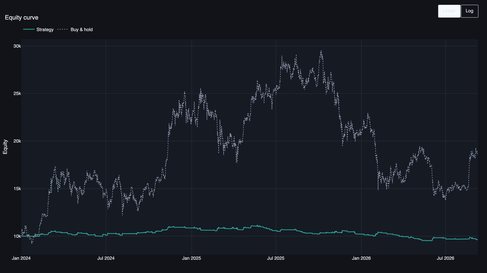
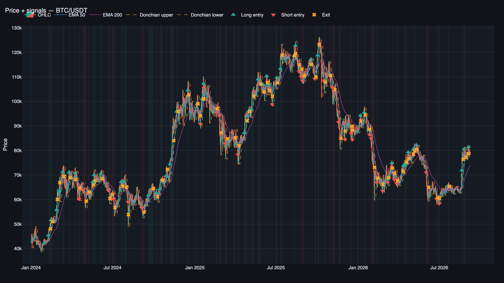
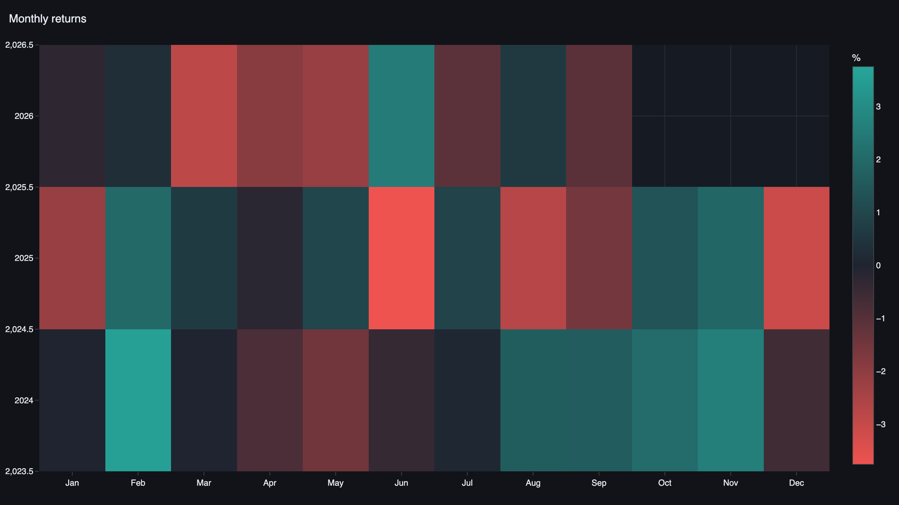
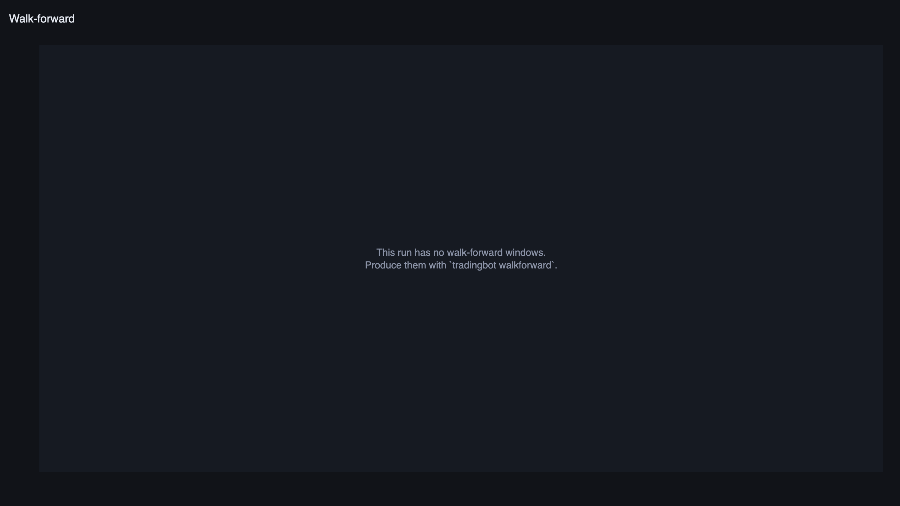

# tradingbot

Исследовательский трейдинг-бот: загрузка исторических данных с биржи, трендследящая
стратегия на пробое канала Дончиана, честный событийный бэктест, интерактивная
аналитика и уведомления о сигналах в Telegram.

Полное техническое задание — [`tech.md`](tech.md).

## Возможности

- Загрузка и инкрементальное кэширование OHLCV с Binance USDT-M Futures (`ccxt`, Parquet).
- Стратегия `donchian_trend`: пробой канала + фильтры тренда, ADX и волатильности, ATR-стопы,
  частичная фиксация и chandelier-трейлинг. Работает в обе стороны — long и short.
- Событийный бэктест с комиссиями, проскальзыванием и funding, с защитой от look-ahead.
- Полный набор метрик доходности и риска, walk-forward валидация, Monte Carlo.
- Интерактивные графики Plotly: Streamlit-дашборд и автономный `report.html`.
- Live/paper-режим с персистентным состоянием и уведомлениями в Telegram.

## Быстрый старт

```bash
make install                 # виртуальное окружение и зависимости
cp .env.example .env         # заполнить токен Telegram
make download                # исторические данные
make backtest                # бэктест
make report                  # report.html
make dashboard               # интерактивный дашборд
```

Либо `tradingbot dashboard` — тот же Streamlit-сервер. В сайдбаре выбирается `run_id`,
фильтры по символу/направлению/периоду и сравнение двух прогонов.

## Дашборд

Страницы Overview, Trades, Chart, Analytics, Walk-Forward и Live.







Walk-Forward и Monte Carlo читают артефакты соответствующего прогона; страница Live
показывает состояние paper-бота из SQLite (`tradingbot live status` / `make bot`).



## Разработка

```bash
make lint        # ruff check + ruff format --check
make typecheck   # mypy --strict
make test        # pytest без интеграционных тестов, с покрытием
make check       # всё вместе
```

## Дисклеймер

Проект является исследовательским инструментом. Сигналы не являются индивидуальной
инвестиционной рекомендацией. Результаты бэктестов не гарантируют будущей доходности.
Автор не несёт ответственности за финансовые потери, возникшие при использовании
этого программного обеспечения.
